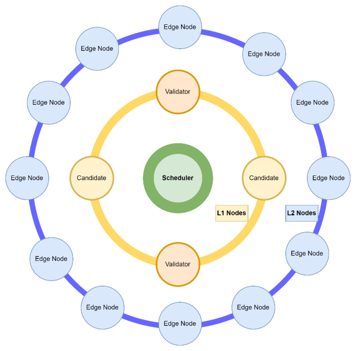

### 1. 当前节点的资源类型和资源分布

Titan 网络中的节点分为三大类：

- **L2 节点 (Edge 节点)**：数量庞大，分布广泛，主要运行在家庭或边缘环境。负责内容的本地存储、分发和用户服务，是 Titan 网络的“最后一公里”。Edge 节点以存储和上行带宽为主要资源.
- **L1 节点（Candidate/Validator）**：L1 节点分为 Candidate 和 Validator 两种角色。Candidate 节点可动态加入/退出，承担辅助存储、计算和抽查任务。Validator 节点则是从 Candidate 节点中按照一定比例和规则选举产生，承担更重的计算、存储、抽查等职责。Validator 节点数量较少，通常部署在数据中心或云端，具备高带宽、高存储、高计算能力。
- **Scheduler（调度器）**：Titan 网络的核心调度与管理节点，负责全网资源调度、任务分配、节点健康监控、数据一致性管理等。Scheduler 具备高可用性和高性能的服务器资源，通常部署在云端或数据中心。
- **Locator（定位服务）**：为节点注册、调度器分配等提供地理区域和网络位置的智能分发能力，帮助节点快速接入最优调度器。Locator 通常为高可用的服务节点，具备良好的网络连通性和稳定性。

**资源分布特点：**
- L2 Edge 节点数量极多，分布于全国各地家庭/边缘网络，形成庞大的分布式资源池。
- L1 Candidate 节点数量适中，作为 Validator 的补充和弹性扩展。
- L1 Validator 节点数量少但能力强，分布于中心机房/云端，由 Candidate 节点动态选举产生。
- Scheduler（调度器）：分布于云端或数据中心，数量有限但具备高可用性和高性能，作为 Titan 网络的核心控制中心，保障全网调度与管理。
- Locator（定位服务）：作为网络入口和调度分发的关键服务，通常为高可用部署，分布于多个区域，保障节点注册和调度器分配的高效与可靠。

#### Titan 网络节点分层结构示意图

> 注：每个区域形成L1+L2+scheduler的内部生态, 最外层为 L2 Edge Node，数量众多；中间为 L1 Candidate/Validator 节点，承担核心任务；最内层为 Scheduler，负责全网调度和管理。Locator结构上独立, 向全部节点提供定位服务.

---

### 2. 当前 storage 的上传与下载接入与流程以及storage 的调度规则

 目前 Storage 的上传与下载均通过外部入口（通常为 titan-explorer）结合 SDK 的方式进行接入，整体流程如下：

2.1 上传流程示例：
- 2.1.1 用户通过入口访问当前 IP 区域（或指定区域）的调度器，获取可用于上传的节点列表及对应的 token。
- 2.1.2 入口处会同步创建任务指标监控及 traceid，实现全流程追踪。
- 2.1.3 调度器根据设定规则，返回一系列满足要求的节点列表。
- 2.1.4 SDK 负责发起单点上传操作。
- 2.1.5 上传完成后，SDK 通过浏览器接口完成 asset 创建，并触发调度器对 carfile 的收录与分发。同时，SDK 会补充和上报 2.1.2 中的追踪指标。

2.2 下载流程示例：
- 2.2.1 用户通过入口访问当前 IP 区域（或指定区域）的调度器，获取包含目标 CID 的节点列表及 token。
- 2.2.2 入口处会同步创建任务指标监控及 traceid，实现全流程追踪。
- 2.2.3 调度器根据设定规则，返回一系列满足要求的节点列表。
- 2.2.4 SDK 按照“能者多劳”原则，发起多点下载操作。
- 2.2.5 下载完成后，SDK 及节点会向调度器提交用户侧/节点侧的工作量证明，同时 SDK 会补充和上报 2.2.2 中的追踪指标。

2.3 此外，L1/L2 节点在提供上传/下载服务的 webserver 中集成了 monitor 组件，用于实时监控所有任务的流量和带宽，并将相关指标元数据作为心跳包参数上传至调度器，作为调度器优选节点策略的重要参考依据。

---

### 3. 目前 Storage 面临的问题与挑战

1. **节点质量发现**  
当前网络中节点数量庞大且异构，如何高效、准确地评估节点的真实服务能力（如带宽、存储、在线率、响应速度等）是系统稳定运行的基础。现有的质量评估手段存在滞后性和不全面的问题，难以及时发现低质量或异常节点，影响整体服务体验和资源调度的准确性。

2. **节点调度逻辑混乱**  
节点调度过程中，受限于多种策略和指标的交叉影响，调度逻辑较为复杂，部分场景下存在节点分配不均、优选节点未被充分利用、调度结果不稳定等问题。调度器在多区域、多类型节点间的任务分配、负载均衡和容错切换等方面仍需进一步梳理和优化，提升调度的智能性和可控性。

3. **节点资源利用率、block索引方式与存储优化**  
目前节点的存储和带宽资源利用率有待提升，部分节点存在资源闲置或分配不合理的现象。block 索引方式尚不完善，导致数据检索效率和存储空间利用率不高。需要进一步优化 block 索引结构、提升数据分片与副本管理的智能化水平，同时探索冷热数据分层存储、 存储按单个block存储和检索，提升整体存储系统的性能和资源利用率。 