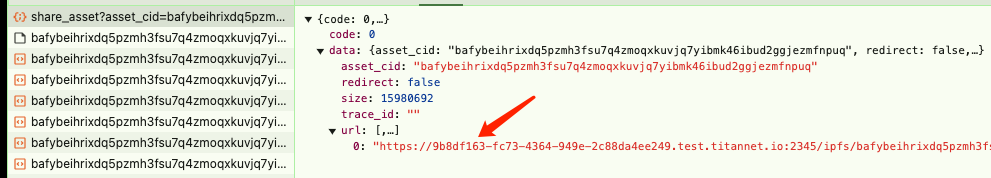
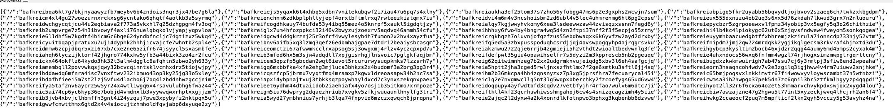

# File Upload and CID List/Data Retrieval Guide

1. **Upload a File**
   - Visit the test server at [https://storage-test.titannet.io/](https://storage-test.titannet.io/), log in, and upload the file you want to demonstrate.

2. **Retrieve the Download Link**
   - Once the file upload is complete, open the developer console (F12) in your browser.
   - Click the download button for the file and observe the response to the `/api/v1/storage/share_asset` request. 
   - Extract the returned download URL, formatted as follows:
     ```plaintext
     https://<node-id-address>/ipfs/<YOUR-CID-HERE>?token=<YOUR-TOKEN>&filename=<YOUR-FILENAME>
     ```

3. **Retrieve All CIDs in the File**
   - To get the list of all sub-CIDs within the file, modify the URL as follows:
     ```plaintext
     https://<node-id-address>/ipfs/<YOUR-CID-HERE>?token=<YOUR-TOKEN>&format=refs
     ```
   - Visit this link to obtain an array list of all sub-CIDs in the file. 

4. **Retrieve Block Data for a Specific CID**
   - To get the block data of a specific CID, modify the URL as follows:
     ```plaintext
     https://<node-id-address>/ipfs/<SUB-CID-YOU-PICK>?token=<YOUR-TOKEN>&format=raw
     ```
   - Visit this link to retrieve the actual block data for the specified CID.
