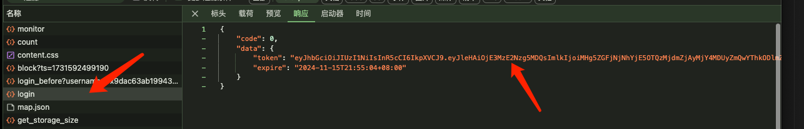
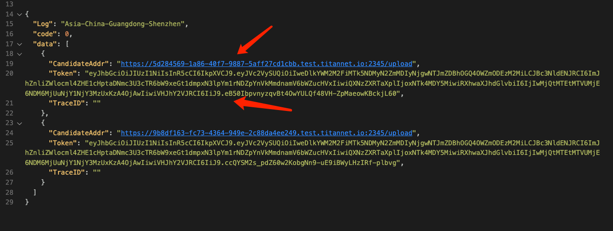

# Retrieve Block Data of Pre-CAR File by CID

1. **Log in to the test server and save your explorer-token**
    - Visit the test server and log in at [https://storage-test.titannet.io/](https://storage-test.titannet.io/) to obtain your `explorer-token`.
    
    
2. **Pre-save the file and get the upload URL using the create_asset API with a curl POST request**
    - Use curl to send a POST request to pre-save the file and obtain the upload URL:
    ```bash
    curl 'https://storage-test-api.titannet.io/api/v1/storage/create_asset' \
        -H 'accept: */*' \
        -H 'content-type: application/json' \
        -H 'jwtauthorization: Bearer <YOUR_EXPLORER_TOKEN>' \
        -H 'lang: en' \
        --data-raw '{"asset_name":"<YOUR_ASSET_NAME>","asset_type":"file","asset_size":<YOUR_ASSET_SIZE>,"group_id":0,"asset_cid":"<YOUR_ASSET_CID>","extra_id":"","need_trace":false,"area_id":[]}'
    ```
- Note:
    - `<YOUR_EXPLORER_TOKEN>` refers to the token obtained in the previous step.
    - `<YOUR_ASSET_NAME>` is the name of the file you are uploading.
    - `<YOUR_ASSET_SIZE>` is the size of the file in bytes.
    - `<YOUR_ASSET_CID>` is the root CID of the file.

- The response will include `CandidateAddr` and `Token`:  
    

3. **Upload the file using the upload API with a curl POST request**
   - Copy and save the returned `upload_url`.
   - Use a curl POST command to upload your file to this URL, for example:
    ```bash
    curl -X POST '<YOUR_UPLOAD_URL>' \
        -H 'Authorization: Bearer <YOUR_UPLOAD_TOKEN>' \
        -F 'file=@<YOUR_CAR_FILE_PATH>'
    ```    
- Note:
    - `<YOUR_UPLOAD_TOKEN>` is the `Token` returned in the previous step.
    - `<YOUR_UPLOAD_URL>` is the `CandidateAddr` from the previous step.
    - `<YOUR_CAR_FILE_PATH>` is the local path to your CAR file.

4. **Retrieve the download link**
   - After uploading the file, refresh the page and open the browser's developer console (F12).
   - Locate the file you just uploaded. Click the download button and observe the response for the `/api/v1/storage/share_asset` request. 
   
   - Extract the download link from the response, which will look like this:
     ```plaintext
     https://<node-id-address>/ipfs/<YOUR-CID-HERE>?token=<YOUR-TOKEN>&filename=<YOUR-FILENAME>
     ```

5. **Retrieve the list of all CIDs for the file**
   - To get the list of all child CIDs under this file, modify the link as follows:
     ```plaintext
     https://<node-id-address>/ipfs/<YOUR-CID-HERE>?token=<YOUR-TOKEN>&format=refs
     ```
   - Accessing this link will return an array list containing all child CIDs. 
   

6. **Retrieve block data of a specific CID**
   - To retrieve the block data of a specific CID, modify the link as follows:
     ```plaintext
     https://<node-id-address>/ipfs/<SUB-CID-YOU-PICK>?token=<YOUR-TOKEN>&format=raw
     ```
   - Accessing this link will provide the data for the specified CID block.
